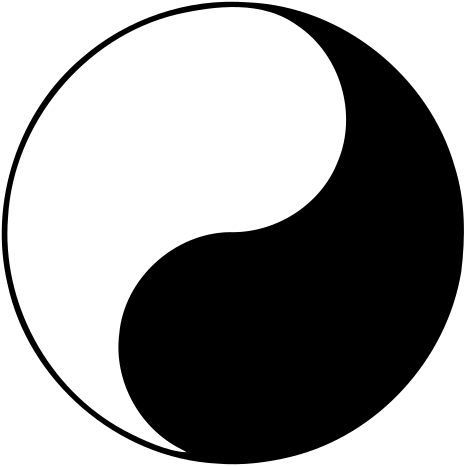

# Tao Te Ching - Lau Tzu : [Translation by Derek Lin](https://taoism.net/tao/tao-te-ching-online-translation/)

The text itself isn't long. 81 chapters or verses each only a handful of lines
long, but the depth of the topic is outstanding. My cursory interpretation should
not be taken as a definitive show of understanding, rather an attempt at
information gathering.

The text isn't easy to understand even with the translation, but the ideas should
shine forth none the less.

## The chapters grouped by the general idea they support/display

This section serves two purposes. Firstly, help and group the chapters in a way
that the idea they are representing are close to one another. Secondly, to
try and extract what each chapter means using a short description. The
interpretation is likely not perfect, but this is how it is.

After restructuring 3 times it seems that there is no point for this grouping
either. All ideas build upon all the other ideas, it is like an untouchable
but coherent looking sphere of light.

### Mystic Virtue, Unattached action, Virtue of non-contention

#### Chapter 3

Desire to become more, to have more, corrupts the spirit and the heart. The issue
is with desiring things, not with getting them or producing them. Desire breeds
greed and confusion but if one can act without desire, without contrivance then the
options become limitless.

#### Chapter 12

Too much pleasure takes away the value. Abundant food is tasteless, abundant
beauty is without color. Focus on what is the most important and cherish that. A
home, warm food, health.

#### Chapter 17

The highest level of influence is achieved by not forcing. When the influence is so
subtle that the influenced feels as things went the natural way.

#### Chapter 22

The sage does not force things to be and that is why things come to be. "The one
who yields and remains whole". Things that are not meant to be will not be, that is
why one should yield and go where they need to go. Where is that can only be known
by becoming whole and returning to oneself.

#### Chapter 24

Similar message as in Chapter 22.

#### Chapter 19

> "Show plainness; hold simplicity
Reduce selfishness; decrease desires"

#### Chapter 30-31

Force has to be applied only at need and only as much as absolutely necessary.
Control is unnatural and whoever seeking it will find themselves taxed in kind.
Nothing can be taken without paying the price.

#### Chapter 41-43

Not forcing idea again.

#### Chapter 44-46

Too much of anything, especially when sought takes the value away and prepares one
for failure.

#### Chapter 48

**Unattached action** is the key for progressing.

#### Chapter 51

**Mystic Virtue** - "Produces but does not possess
Acts but does not flaunt
Nurtures but does not dominate"

#### Chapter 57-59

The less force the better.

#### Chapter 60

As the Tao is based on no force, thus it cannot do harm.

#### Chapter 61

Ask and it shall be given to you.

#### Chapter 64

Life is easy when things are going our way, but when they get hard many of us fail.
People start on long journeys without knowing the road or the end, so when they
would finally finish they get careless and fail. By desiring the end we loose the
sight of what is. Letting go of desire, letting go of unnecessary things will
redeem the us.

#### Chapter 65

The **Mystic Virtue** lies in simplicity. Simple things are simple by definition.
They do not bring excess complexity to life and with less complexity, people
flourish.

#### Chapter 68

**Virtue of non-contention** is about not forcing. A theme that appears through and
through in the text.

#### Chapter 69

Compassion.

#### Chapter 73

Same idea of no force is repeated again.

#### Chapter 78

Water is used as a metaphor for acting without force. It is shapeless and formless,
yet it can take any form, it is soft, yet it can grind mountains into dust.

#### Chapter 80

This chapter is the same as the idea in the [Bible - Matthew 5:5](https://biblehub.com/matthew/5-5.htm):
> Blessed are the meek, for they will inherit the earth.
Meek - "the character of one who has the passion of resentment under control, and
who is therefore tranquil and untroubled" - Ellicott's Commentary for English
Readers on the above linked page

#### Chapter 10

By letting go of things can they truly be grasped. Achieving is wrong if we allow
arrogance, having is wrong if it brings possessiveness. The act of moving forward
without getting corrupted is called the **Mystic Virtue**.

#### Chapter 38

By controlling things we are misguided in everything we do and without the
stability of the peace of mind we loose control. Then trying to chase it more and
more only leads to chaos. When control is released one can see what is real, what
has real value.

#### Chapter 81

Truth is hard and we must face it, but we cannot force others to do so. We can only
give. Give the support for change, but not the necessity for change. By that we
would desire them to change and that spoils our intentions.
To get, one must give first.

#### Chapter 4-5

The Tao is the power of life. It produces without taking.

#### Chapter 9

Appreciate success, but do not chase it. Fame, positions of power and wealth bring
disasters upon their bearers. **Withdraw yourself - Tao of Heaven**

#### Chapter 8

The Tao is like water. It benefits all without content and thus it is beyond
reproach itself.

#### Chapter 15

The Tao encompasses all. It cannot be exhausted and overused. It benefits all.

#### Chapter 18

When the Tao is lost, intelligence takes it's place, but by loosing the divine,
chaos ensues.

#### Chapter 23

Life should be embraced with all it's pains and pleasantries. Loss has to be
embraced for loss to embrace us, virtues need to be embraced before they can bless
us. One cannot get without giving and the Tao accepts all whether it is accepted
or not.

#### Chapter 34-37

The Tao nourishes all the same, without judgement or desire. Whether bad or good
happens the Tao flows the same.
Acceptance is key. Not a thing can be forced. Whenever force is applied to opposite
outcome manifests, but by accepting, the barriers can be dissolved.

#### Chapter 66

One of the clearest chapters. After reading it multiple times it seems clear that
this chapter is the most important one. Simply states what the Tao is about.
To move forward or to get in front of things one must approach the everything
with humility. With the acceptance that they may not be able to change anything
for the better.
As they are not trying to force one thing or another they do not encounter
resistance and without resistance things naturally progress as they should.

An example is given of working with people. If one wishes to help them, to detach
from them (put themselves before them, same idea of getting above them in a
hierarchy) then one must approach them with utmost humility. Has to listen to them
and help in the exact way they wish to be helped. Then others will not feel
burdened or controlled and they would wish to comply even more.

#### Chapter 67 -- *3 pillars*

Compassion, conservation and not daring to be ahead in the world is what makes the
Tao so great.

Compassion allows one to have courage to act. If things are valuable then we can
sacrifice for them.

Conservation gives meaning to everything that already is in the world. Our current
situation and opportunities. By seeing the meaning in everything there is we can
act in a way that has beneficial impact on everything. Those benefits propagate
outwards and thus soon will have a great impact upon the world.

Not daring to be ahead in the world is that one does not allow themselves to think
that they are in any way better than anybody else. There is great humility in this
idea. By doing this one stays grounded at all times and people would naturally look
for their guidance.

#### Chapter 77

A confusing idea that appears again and again. The Tao is about balance and
balancing without forcing or claiming credit for the outcome. A sense of detached
action permeates the idea. One does not desire to have things so they can give it
away, one does not desire to receive so they can truly help and because the outcome
is not claimed, whether it is good or bad one can proceed.

### Essential wonder

#### Chapter 7

The things that cannot be named, let's call them divine from here on, last forever
because they do not exist for themselves.
The sage achieves it's goals by serving others.

#### Chapter 27

A sage helps where it can and does not abandon anyone. A bad person is as necessary
for the good person as the good for the bad. The good person can teach the bad one
and the bad acts as a source of meaning for the good one.
More generally a problem needs it's solver. The solver must appreciate the problem
and vice-versa otherwise things get confused and one is left wondering of the
chaos. This is called the **Essential wonder**.

#### Chapter 33

The symbol of the self being as the base for real strength and peace appears again.
Similarly the act of serving others. Service for others allows one to not be
forgotten after they have died.

#### Chapter 40

The circularity of life and of everything. What begins, ends and what ends shall
begin.

#### Chapter 75

Desiring things inevitably corrupts the outcome. Even the want for life can corrupt
life itself. Wanting more takes away from others, if others have too little we all
suffer.

#### Chapter 50

Life of excess is a burden. Excess brings vulnerability. It brings loss.

#### Chapter 1

Introduces the concept that the true Tao is something that cannot be named. As it
is the essence of nature, like Heaven and Earth itself. Trying to name it takes
away from it's glory. Things that can be named and those which cannot are born from
the same place. Named things are tangible, thing which cannot be named are divine.

#### Chapter 2

Everything in the world has a duality. Good cannot exist without evil, beauty
cannot exist without the ugly, existence has no meaning without none existence.
This is the nature of things and as such a sage does not get attached to either
side of existence.

>"They work with myriad things but do not control
They create but do not possess
They act but do not presume
They succeed but do not dwell on success"

#### Chapter 6

**Mystic Female** - Females are the creators of life and as such they posses a
divine energy.

#### Chapter 11

The value of a thing is not necessarily in what it is, but rather what it isn't.
A room, a container, a window all have their value in being empty.

#### Chapter 21

The Tao is unclear and it cannot be clear. It is all that is and should be, the
essence of life and within it lies faith.

#### Chapter 25

Similar to Chapter 21. The Tao is divine and thus cannot be fully understood.

#### Chapter 26

Everything there is, is there with a reason. Without being restless one cannot be
quite, without heaviness there is no lightness. If any side is lost then the whole
is destabilized.

#### Chapter 28

To live properly the two sides always have to be integrated at once. To act
rightly one must know how to be bad. To be masculine, one has to be able to be
feminine. To be boundless one has to know their limits. If things are kept in the
balance the world remains whole.

#### Chapter 29

Arrogance, excess and extremes are far from balance and cannot be. Existence seeks
balance and whether by force or wit one tries to change this, they will inevitably
fail.

#### Chapter 53

The Tao is simple like a great river. Deviate to the banks and you are lost. Too
much or too little is bad the same way.

#### Chapter 62

Value what is, because that is life. The good and the bad is all part of it and
all are necessary.

### Mystic Oneness

#### Chapter 39

The good and the bad are the two sides that belong together and only by achieving
oneness can stability be attained. However when something of value is achieved, one
mustn't forget that loss is necessary as well. Taking pride in what is takes away
it's value, especially as many things in life the result was perhaps nothing more
than luck.

#### Chapter 49

An open mind allows one to connect with everyone, to listen to everyone and by
doing so accept them.

#### Chapter 76

Being adaptive and flexible is the source of life. Dead things are hard and brittle
, living things are soft and supple. The way of life is flexibility, the way of
death is hardness.

#### Chapter 13 -- *Importance of the self*

The self is of the highest importance. It is the source of great pain or of great
strength. Existence itself is a misfortune if treated improperly, but if one learns
to value and love the self truly and deeply without judgement has the right to
inherit the world.

#### Chapter 16 -- *Acceptance is divine*

The self is safe when it has accepted itself and by doing so detached itself from
the named things (myriad in the text). When one returns to one's nature they
achieve tranquility. By looking inwards and finding the truth one reaches
constancy a form of clarity. Achieving this allows for radical acceptance
without judgement which is the manifestation of the divine.

#### Chapter 47

Everything one needs is already within.

#### Chapter 54

At the center of all things lies the individual. When the individual is put
together, the family can be put together, then the community and finally the whole
country. By constantly fixing bigger and more complex things, everything becomes
better.

#### Chapter 55

Carry yourself properly and the world may not hurt you.

#### Chapter 56

**Mystic Oneness** - Think before you speak and speak only when necessary, avoid
the extremes and find the answers.

#### Chapter 63

Be humble and do what you can right now. Do the best you can right now. It doesn't
have to be something big. Every small task eventually leads to the solution of
something great. Handle the completion of small tasks with just as much value as
the completion of big tasks would be.

#### Chapter 70-72

Humility.

#### Chapter 79

Holding onto resentment corrupts connections. It is not one's duty to enforce or
judge how someone behaves, but it is their duty to keep true to their word.

#### Chapter 20

Value life and you will be at peace.

#### Chapter 52

Life has to be valued with all it's force. When one returns to the source can they
be safe from disaster.

#### Chapter 74

There is a nature of things that should not be meddled with. Like death some things
come for us all. Only if one allows themselves to be afraid is that they can be
hurt by whatever may come.

#### Chapter 14 -- *Some things don't need to be understood to be of great value.*

The **Tao Axiom**. Colorless, formless, shapeless, began in nothing and it will
return to nothing after an eternity. It cannot be named, but it can be used to live
life properly.

## The Tao as I have understood it

The Tao Te Ching [Tao and Virtue Classic - Derek Lin](http://taoism.net/tao/about-the-tao-te-ching/) is about life itself. Simply stated it is how things
were, are and should be and what that understanding means to a person trying to
live life to the fullest.

The Tao encompasses life itself with everything and all within it so even trying to
name this way of life is faulty. A humbling observation that should be kept at the
forefront of our minds while trying to comprehend a text such as the The Te Ching.
It would be arrogant to assume we, as mortal individuals, could possibly come up
with a fitting name that would state the totality of life. That said we have to
talk about it, because it is important and as such the Tao was used. It must be
remembered, however that the Tao that we name isn't the Tao that we are trying
to name.

Perhaps the ideas can be boiled down to the psychological term of radical
acceptance. It might be an oversimplification, but it can be an helpful idea.
> Radical acceptance: "Accepting life on life's terms and not resisting what you
cannot or choose not to change. Radical acceptance is about saying yes to life,
just as it is." - Dr. Karin Hall, Psychology Today

It does it little justice, but to be able to handle the material the core ideas
presented in it have to be brought to the surface. None of these ideas can be
truly separated from one another, but yet again, the topic handled here is about
everything and all, and how one should act knowing the ramifications of that.

The core ideas represented in the text are the Mystic Virtue, Mystic Oneness and
the Essential Wonder. Each depend on one another forming a coherent whole. To
understand that concept let's first examine the idea of Essential Wonder.

### The Essential Wonder

The Essential Wonder is best represented by the well known Chinese symbol of the
Ying and Yang.

Absolutely everything one can perceive exists in balance with a counterpart. Both
sides are of the exact same importance and cannot exist without one another.
Darkness cannot exist without light, happiness cannot exist without suffering and
love cannot exist without hate. The key observation here is that both sides are
not just necessary, but are actually the same thing. If one thing cannot exist
without the other than they are in essence a single entity. In this sense to truly
embrace the positive side of anything the negative side has to be embraced as well.
This sounds simple, but in practice means that if one truly loves to help people
they are grateful for having people around who need help. The idea seems
counterproductive. Very few people would dare to claim that they like people
suffering, but this is exactly what the symbol represents. Or in other terms that
may be easier to connect with, if one enjoys having good days when everything goes
perfectly and worry seems like a distant idea, then they also enjoy the days when
catastrophes are lining up, the future is uncertain and internal suffering has
reached it's maximum.

That is what the **Essential Wonder** means. Everything that there is has something
opposing it and the "eternal battle" of these forces is what it means to be. To
embrace life one has to accept the necessity of everything there is.

### Mystic Oneness

Mystic Oneness is the observation that all that one needs is within. If the balance
within the person is achieved then there is little that can be of harm coming
from the outside.
“When there is no enemy within, the enemy outside can do you no harm.” -African
Proverb

Are you confident in your abilities? Do people around you challenge that
confidence? To which extent are they right? They might be right, but they will
never completely be. Your reality is only yours to have. Listening to outside
influences and confusing our inner world are separate things. One can listen, but
not be shaken to the core by what is learned.
Life is undeniably very hard and one is well instructed to accept that fact. In
whatever way they have managed to survive was the right way. There is no need or
reason to dwell on past mistakes other than observing what could have been done
better. That is it and that is all. When accepting **The Essential Wonder** of life
one accepts all of their mistakes as necessary steps towards the valued future.
A balance of mistakes and victories have to exist, and only mistakes can teach us
the valuable lessons that we need proceeding forward.
Mystic Oneness is the realization that I as an entity am fallible and mortal. I
will make mistakes because that is the nature of things. People will make mistakes
, because that is the nature of things. I will fail in my journey/task/duty,
because that is the nature of things.
By accepting ones wretchedness one can become powerful beyond comprehension. The
moment this step is taken, one has accepted that they will inevitably fail, they
have understood that that is a necessary step; and have decided, despite all of
that, that whatever they have set out to accomplish is worth every moment of all
that it takes to live it trough.
This is what it means to be one with oneself. Accepting total responsibility to
who we are with all of it's negative and positive aspects and striving to proceed
in the direction which we, as individuals, see fit.
The beauty of life is within us all, we are divine just by being here, accepting
that is the greatest gift we can receive and give to others as well.

### Mystic Virtue

The last part to the Tao seems to be the idea of not forcing, called as **Mystic
Virtue** from the text.
A profound idea that is only understandable in conjunction with **The Essential
Wonder** and **Mystic Oneness**.
Not forcing means that one does not desire any outcome, does not wish to achieve
for the sake or achieving. Desire is depicted as something that ultimately corrupts
all ideas, intents and emotions. One cannot truly help anyone if they desire to
help them. Why? Because then you either force a solution on the individual or
you manipulate them in ever so subtle ways so that you may get ahead in life,
disguised as help. You may want to fell better, by making them feel better.
In other words you are not one with yourself and that is corrupting your
originally genuine intentions.

The issue is not with acting in a way that is aimed at producing an outcome.
Necessity can be a perfectly viable force guiding our actions and keeping them
true. The necessity for influence so that one can help other people is worlds apart
from desiring to get influence. The first one is honest and humble, free from other
baggage while the second approach has some lie in it. Something sinister.

When things or outcomes are not desired then the person is in essence free from
failing in achieving them. This brings them more attuned with **The Essential
Wonder**. They accept that reality is not there to serve them in any way and things
more often than not might not work out as aimed at. That is okay. Necessity will
sustain a person in a given pursuit even if failure was faced many times, desire
cannot.

Not desiring and not forcing doesn't mean that force cannot or should not be
applied. Sometimes it is unavoidable to apply force. The difference between doing
it properly and improperly is in the desire of doing so. If one takes up arms to
protect themselves then they act out of necessity. However, if they take up arms
so they can take revenge then they are acting out of the desire to have the
revenge. In that they corrupt their character and keep on propagating the suffering
that has prompted them to take action.

Achieving things, producing value, helping others, acting out of necessity are all
good things as long as one dares not take pride in their successes. Succeeding is
a good thing. Lording that success over others on the other hand is filled with the
desire to be better than them.
